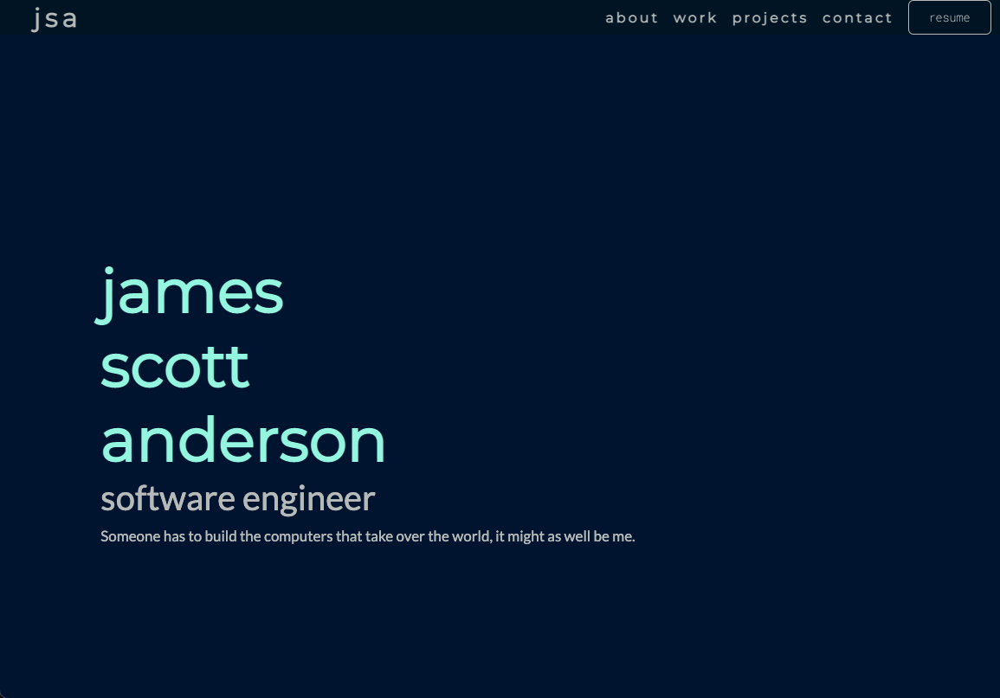

# jsa v1

Thanks for checking out my repo! This is the v1 of my portfolio page and the overall purpose (other than to show off projects) 
was to build components and styling from scratch. After using Material UI and Bootstrap, I wanted to understand how the components
such as a carousel were made. So, I made them. 

## tech stack.

- React
- React Router
- Webpack/Babel
- Nodejs